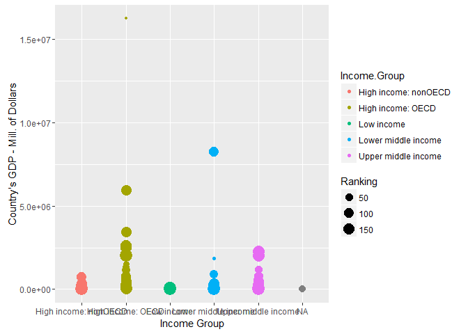

# MSDS_6306_Case_Study_1
Jim Brittain  
October 26, 2016  


### Introduction
In this analysis report we plan to look at the possible relation of various countries’ Gross Domestic Product (GDP) and average income for the given country.  We will be using data available from the World Bank’s website: data.worldbank.org.  We plan to do some high-level analysis of these two variables for the various countries.   It is our hope that this analysis may show some promise for further statistical analysis in the future.

### Call each code section's make file

### Download the data files

```r
source(file.path(MainDir, "Code", "Download_Files.R"), echo = TRUE, keep.source = TRUE)
```

```
## 
## > ############################################
## > ## Download Case Study 1 Data Files
## > ## Jim Brittain
## > ## 2016-10-27
## > ############################# .... [TRUNCATED] 
## 
## > # Download files to Download folder
## > download.file(url="https://d396qusza40orc.cloudfront.net/getdata%2Fdata%2FGDP.csv",
## +               destfile=" ..." ... [TRUNCATED] 
## 
## > download.file(url="https://d396qusza40orc.cloudfront.net/getdata%2Fdata%2FEDSTATS_Country.csv",                   destfile="EDSTATS_Country.csv")
```

### Read and Clean files

```r
source(file.path(MainDir, "Code", "ReadNClean_Files.R"), echo = TRUE, keep.source = TRUE)
```

```
## 
## > ############################################
## > ## Read-in and Clean Case Study 1 Data Files
## > ## Jim Brittain
## > ## 2016-10-27
## > #################### .... [TRUNCATED] 
## 
## > getwd()
## [1] "D:/Users/Jim/SMU/MSDS 6306 DOING DATA SCIENCE/GIT/MSDS_6306_Case_Study_1/Download_Files"
## 
## > GDPRaw     <- read.csv(file="GDP.csv", header=FALSE)
## 
## > EdStatsRaw <- read.csv(file="EDSTATS_Country.CSV", header=TRUE)
## 
## > setwd(MainDir)
## 
## > # Create a new version of GDP data and clean that one
## > GDP <- GDPRaw[6:325,]
## 
## > dim(GDP)
## [1] 320  10
## 
## > head(GDP)
##     V1 V2 V3             V4           V5 V6 V7 V8 V9 V10
## 6  USA  1 NA  United States  16,244,600     NA NA NA  NA
## 7  CHN  2 NA          China   8,227,103     NA NA NA  NA
## 8  JPN  3 NA          Japan   5,959,718     NA NA NA  NA
## 9  DEU  4 NA        Germany   3,428,131     NA NA NA  NA
## 10 FRA  5 NA         France   2,612,878     NA NA NA  NA
## 11 GBR  6 NA United Kingdom   2,471,784     NA NA NA  NA
## 
## > tail(GDP)
##     V1 V2 V3 V4 V5 V6 V7 V8 V9 V10
## 320       NA          NA NA NA  NA
## 321       NA          NA NA NA  NA
## 322       NA          NA NA NA  NA
## 323       NA          NA NA NA  NA
## 324       NA          NA NA NA  NA
## 325       NA          NA NA NA  NA
## 
## > # Keep only the 4 populated variables
## > GDP <- GDP[c(1,2,4,5)]
## 
## > # Drop records where Country Code is blank
## > GDP <- subset(x=GDP, GDP$V1!="")
## 
## > names(GDP) <- c("CountryCode","Ranking","Country","GDPDollars")
## 
## > # Drop records after row 220 
## > # because at that point the original file lists subtotals by various groups
## > GDP <- GDP[1:214,] 
## 
## > # Remove commas and convert GDPDollars to numeric
## > GDP$GDPDollars <- gsub(",","", GDP$GDPDollars)
## 
## > GDP$GDPDollars <- as.numeric(GDP$GDPDollars)
```

```
## Warning: NAs introduced by coercion
```

```
## 
## > # Convert Ranking to numeric
## > GDP$Ranking <- as.numeric(GDP$Ranking)
## 
## > # Get a count of NAs for each variable of interest
## > summary(GDP)
##   CountryCode     Ranking                 Country      GDPDollars      
##  ABW    :  1   Min.   :  1.00   Afghanistan   :  1   Min.   :      40  
##  ADO    :  1   1st Qu.: 32.25   Albania       :  1   1st Qu.:    7005  
##  AFG    :  1   Median : 85.50   Algeria       :  1   Median :   27638  
##  AGO    :  1   Mean   : 86.20   American Samoa:  1   Mean   :  377652  
##  ALB    :  1   3rd Qu.:137.75   Andorra       :  1   3rd Qu.:  205289  
##  ARE    :  1   Max.   :191.00   Angola        :  1   Max.   :16244600  
##  (Other):208                    (Other)       :208   NA's   :24        
## 
## > # Look at CountryCodes
## > table(GDP$CountryCode)
## 
##     ABW ADO AFG AGO ALB ARE ARG ARM ASM ATG AUS AUT AZE BDI BEL BEN BFA 
##   0   1   1   1   1   1   1   1   1   1   1   1   1   1   1   1   1   1 
## BGD BGR BHR BHS BIH BLR BLZ BMU BOL BRA BRB BRN BTN BWA CAF CAN CHE CHI 
##   1   1   1   1   1   1   1   1   1   1   1   1   1   1   1   1   1   1 
## CHL CHN CIV CMR COG COL COM CPV CRI CUB CUW CYM CYP CZE DEU DJI DMA DNK 
##   1   1   1   1   1   1   1   1   1   1   1   1   1   1   1   1   1   1 
## DOM DZA EAP ECA ECU EGY EMU ERI ESP EST ETH FIN FJI FRA FRO FSM GAB GBR 
##   1   1   0   0   1   1   0   1   1   1   1   1   1   1   1   1   1   1 
## GEO GHA GIN GMB GNB GNQ GRC GRD GRL GTM GUM GUY HIC HKG HND HRV HTI HUN 
##   1   1   1   1   1   1   1   1   1   1   1   1   0   1   1   1   1   1 
## IDN IMY IND IRL IRN IRQ ISL ISR ITA JAM JOR JPN KAZ KEN KGZ KHM KIR KNA 
##   1   1   1   1   1   1   1   1   1   1   1   1   1   1   1   1   1   1 
## KOR KSV KWT LAC LAO LBN LBR LBY LCA LIC LIE LKA LMC LMY LSO LTU LUX LVA 
##   1   1   1   0   1   1   1   1   1   0   1   1   0   0   1   1   1   1 
## MAC MAF MAR MCO MDA MDG MDV MEX MHL MIC MKD MLI MLT MMR MNA MNE MNG MNP 
##   1   1   1   1   1   1   1   1   1   0   1   1   1   1   0   1   1   1 
## MOZ MRT MUS MWI MYS NAM NCL NER NGA NIC NLD NOR NPL NZL OMN PAK PAN PER 
##   1   1   1   1   1   1   1   1   1   1   1   1   1   1   1   1   1   1 
## PHL PLW PNG POL PRI PRK PRT PRY PYF QAT ROM RUS RWA SAS SAU SDN SEN SGP 
##   1   1   1   1   1   1   1   1   1   1   1   1   1   0   1   1   1   1 
## SLB SLE SLV SMR SOM SRB SSA SSD STP SUR SVK SVN SWE SWZ SXM SYC SYR TCA 
##   1   1   1   1   1   1   0   1   1   1   1   1   1   1   1   1   1   1 
## TCD TGO THA TJK TKM TMP TON TTO TUN TUR TUV TZA UGA UKR UMC URY USA UZB 
##   1   1   1   1   1   1   1   1   1   1   1   1   1   1   0   1   1   1 
## VCT VEN VIR VNM VUT WBG WLD WSM YEM ZAF ZAR ZMB ZWE 
##   1   1   1   1   1   1   0   1   1   1   1   1   1 
## 
## > # Create a new version of GDP data and clean that one
## > EdStats <- EdStatsRaw
## 
## > dim(EdStatsRaw)
## [1] 234  31
## 
## > head(EdStatsRaw)
##   CountryCode                    Long.Name         Income.Group
## 1         ABW                        Aruba High income: nonOECD
## 2         ADO      Principality of Andorra High income: nonOECD
## 3         AFG Islamic State of Afghanistan           Low income
## 4         AGO  People's Republic of Angola  Lower middle income
## 5         ALB          Republic of Albania  Upper middle income
## 6         ARE         United Arab Emirates High income: nonOECD
##                       Region Lending.category Other.groups  Currency.Unit
## 1  Latin America & Caribbean                                Aruban florin
## 2      Europe & Central Asia                                         Euro
## 3                 South Asia              IDA         HIPC Afghan afghani
## 4         Sub-Saharan Africa              IDA              Angolan kwanza
## 5      Europe & Central Asia             IBRD                Albanian lek
## 6 Middle East & North Africa                                U.A.E. dirham
##   Latest.population.census  Latest.household.survey
## 1                     2000                         
## 2           Register based                         
## 3                     1979               MICS, 2003
## 4                     1970 MICS, 2001, MIS, 2006/07
## 5                     2001               MICS, 2005
## 6                     2005                         
##                                                                 Special.Notes
## 1                                                                            
## 2                                                                            
## 3 Fiscal year end: March 20; reporting period for national accounts data: FY.
## 4                                                                            
## 5                                                                            
## 6                                                                            
##   National.accounts.base.year National.accounts.reference.year
## 1                        1995                               NA
## 2                                                           NA
## 3                   2002/2003                               NA
## 4                        1997                               NA
## 5                                                         1996
## 6                        1995                               NA
##   System.of.National.Accounts SNA.price.valuation
## 1                          NA                    
## 2                          NA                    
## 3                          NA                 VAB
## 4                          NA                 VAP
## 5                        1993                 VAB
## 6                          NA                 VAB
##   Alternative.conversion.factor PPP.survey.year
## 1                                            NA
## 2                                            NA
## 3                                            NA
## 4                       1991-96            2005
## 5                                          2005
## 6                                            NA
##   Balance.of.Payments.Manual.in.use External.debt.Reporting.status
## 1                                                                 
## 2                                                                 
## 3                                                           Actual
## 4                              BPM5                         Actual
## 5                              BPM5                         Actual
## 6                              BPM4                               
##   System.of.trade Government.Accounting.concept
## 1         Special                              
## 2         General                              
## 3         General                  Consolidated
## 4         Special                              
## 5         General                  Consolidated
## 6         General                  Consolidated
##   IMF.data.dissemination.standard
## 1                                
## 2                                
## 3                            GDDS
## 4                            GDDS
## 5                            GDDS
## 6                            GDDS
##   Source.of.most.recent.Income.and.expenditure.data
## 1                                                  
## 2                                                  
## 3                                                  
## 4                                         IHS, 2000
## 5                                        LSMS, 2005
## 6                                                  
##   Vital.registration.complete Latest.agricultural.census
## 1                                                       
## 2                         Yes                           
## 3                                                       
## 4                                                1964-65
## 5                         Yes                       1998
## 6                                                   1998
##   Latest.industrial.data Latest.trade.data Latest.water.withdrawal.data
## 1                     NA              2008                           NA
## 2                     NA              2006                           NA
## 3                     NA              2008                         2000
## 4                     NA              1991                         2000
## 5                   2005              2008                         2000
## 6                     NA              2008                         2005
##   X2.alpha.code WB.2.code           Table.Name           Short.Name
## 1            AW        AW                Aruba                Aruba
## 2            AD        AD              Andorra              Andorra
## 3            AF        AF          Afghanistan          Afghanistan
## 4            AO        AO               Angola               Angola
## 5            AL        AL              Albania              Albania
## 6            AE        AE United Arab Emirates United Arab Emirates
## 
## > tail(EdStatsRaw)
##     CountryCode                        Long.Name        Income.Group
## 229         WSM                            Samoa Lower middle income
## 230         YEM                Republic of Yemen Lower middle income
## 231         ZAF         Republic of South Africa Upper middle income
## 232         ZAR Democratic Republic of the Congo          Low income
## 233         ZMB               Republic of Zambia          Low income
## 234         ZWE             Republic of Zimbabwe          Low income
##                         Region Lending.category Other.groups
## 229        East Asia & Pacific              IDA             
## 230 Middle East & North Africa              IDA             
## 231         Sub-Saharan Africa             IBRD             
## 232         Sub-Saharan Africa              IDA         HIPC
## 233         Sub-Saharan Africa              IDA         HIPC
## 234         Sub-Saharan Africa            Blend             
##          Currency.Unit Latest.population.census Latest.household.survey
## 229        Samoan tala                     2006                        
## 230        Yemeni rial                     2004              MICS, 2006
## 231 South African rand                     2001               DHS, 2003
## 232    Congolese franc                     1984                DHS 2007
## 233     Zambian kwacha                     2000               DHS, 2007
## 234    Zimbabwe dollar                     2002            DHS, 2005/06
##                                                                   Special.Notes
## 229                                                                            
## 230                                                                            
## 231 Fiscal year end: March 31; reporting period for national accounts data: CY.
## 232                                                                            
## 233                                                                            
## 234  Fiscal year end: June 30; reporting period for national accounts data: CY.
##     National.accounts.base.year National.accounts.reference.year
## 229                        2002                               NA
## 230                        1990                               NA
## 231                        2000                               NA
## 232                        1987                               NA
## 233                        1994                               NA
## 234                        1990                               NA
##     System.of.National.Accounts SNA.price.valuation
## 229                          NA                 VAB
## 230                          NA                 VAP
## 231                        1993                 VAB
## 232                        1993                 VAB
## 233                          NA                 VAB
## 234                          NA                 VAB
##     Alternative.conversion.factor PPP.survey.year
## 229                                            NA
## 230                       1990-96            2005
## 231                                          2005
## 232                       1999-01            2005
## 233                       1990-92            2005
## 234                    1991, 1998            2005
##     Balance.of.Payments.Manual.in.use External.debt.Reporting.status
## 229                              BPM5                    Preliminary
## 230                              BPM5                         Actual
## 231                              BPM5                    Preliminary
## 232                              BPM5                       Estimate
## 233                              BPM5                    Preliminary
## 234                              BPM5                         Actual
##     System.of.trade Government.Accounting.concept
## 229         General                              
## 230         General                     Budgetary
## 231         General                  Consolidated
## 232         Special                  Consolidated
## 233         General                     Budgetary
## 234         General                  Consolidated
##     IMF.data.dissemination.standard
## 229                                
## 230                            GDDS
## 231                            SDDS
## 232                            GDDS
## 233                            GDDS
## 234                            GDDS
##     Source.of.most.recent.Income.and.expenditure.data
## 229                                                  
## 230                                       ES/BS, 2005
## 231                                       ES/BS, 2000
## 232                                    1-2-3, 2005-06
## 233                                      IHS, 2004-05
## 234                                                  
##     Vital.registration.complete Latest.agricultural.census
## 229                                                   1999
## 230                                                   2002
## 231                                                   2000
## 232                                                   1990
## 233                                                   1990
## 234                                                   1960
##     Latest.industrial.data Latest.trade.data Latest.water.withdrawal.data
## 229                     NA              2008                           NA
## 230                   2005              2008                         2000
## 231                   2005              2008                         2000
## 232                     NA              1986                         2000
## 233                     NA              2008                         2000
## 234                   1995              2008                         2002
##     X2.alpha.code WB.2.code       Table.Name      Short.Name
## 229            WS        WS            Samoa           Samoa
## 230            YE        RY      Yemen, Rep.           Yemen
## 231            ZA        ZA     South Africa    South Africa
## 232            CD        ZR Congo, Dem. Rep. Dem. Rep. Congo
## 233            ZM        ZM           Zambia          Zambia
## 234            ZW        ZW         Zimbabwe        Zimbabwe
## 
## > # Drop records that are regional agregates (All have missing Region)
## > EdStats <- subset(x=EdStats, EdStats$Region!="")
## 
## > # Keep only the variables that I am interested in 
## > EdStats <- EdStats[1:4] 
## 
## > summary(EdStats)
##   CountryCode                   Long.Name                 Income.Group
##  ABW    :  1   American Samoa        :  1                       : 0   
##  ADO    :  1   Antigua and Barbuda   :  1   High income: nonOECD:37   
##  AFG    :  1   Arab Republic of Egypt:  1   High income: OECD   :30   
##  AGO    :  1   Argentine Republic    :  1   Low income          :40   
##  ALB    :  1   Aruba                 :  1   Lower middle income :56   
##  ARE    :  1   Barbados              :  1   Upper middle income :47   
##  (Other):204   (Other)               :204                             
##                         Region  
##  Europe & Central Asia     :57  
##  Sub-Saharan Africa        :47  
##  Latin America & Caribbean :38  
##  East Asia & Pacific       :36  
##  Middle East & North Africa:21  
##  South Asia                : 8  
##  (Other)                   : 3  
## 
## > # Look at CountryCodes
## > table(EdStats$CountryCode)
## 
## ABW ADO AFG AGO ALB ARE ARG ARM ASM ATG AUS AUT AZE BDI BEL BEN BFA BGD 
##   1   1   1   1   1   1   1   1   1   1   1   1   1   1   1   1   1   1 
## BGR BHR BHS BIH BLR BLZ BMU BOL BRA BRB BRN BTN BWA CAF CAN CHE CHI CHL 
##   1   1   1   1   1   1   1   1   1   1   1   1   1   1   1   1   1   1 
## CHN CIV CMR COG COL COM CPV CRI CUB CYM CYP CZE DEU DJI DMA DNK DOM DZA 
##   1   1   1   1   1   1   1   1   1   1   1   1   1   1   1   1   1   1 
## EAP EAS ECA ECS ECU EGY EMU ERI ESP EST ETH FIN FJI FRA FRO FSM GAB GBR 
##   0   0   0   0   1   1   0   1   1   1   1   1   1   1   1   1   1   1 
## GEO GHA GIN GMB GNB GNQ GRC GRD GRL GTM GUM GUY HIC HKG HND HPC HRV HTI 
##   1   1   1   1   1   1   1   1   1   1   1   1   0   1   1   0   1   1 
## HUN IDN IMY IND IRL IRN IRQ ISL ISR ITA JAM JOR JPN KAZ KEN KGZ KHM KIR 
##   1   1   1   1   1   1   1   1   1   1   1   1   1   1   1   1   1   1 
## KNA KOR KSV KWT LAC LAO LBN LBR LBY LCA LCN LDC LIC LIE LKA LMC LMY LSO 
##   1   1   1   1   0   1   1   1   1   1   0   0   0   1   1   0   0   1 
## LTU LUX LVA MAC MAR MCO MDA MDG MDV MEA MEX MHL MIC MKD MLI MLT MMR MNA 
##   1   1   1   1   1   1   1   1   1   0   1   1   0   1   1   1   1   0 
## MNE MNG MNP MOZ MRT MUS MWI MYS NAC NAM NCL NER NGA NIC NLD NOC NOR NPL 
##   1   1   1   1   1   1   1   1   0   1   1   1   1   1   1   0   1   1 
## NZL OEC OMN PAK PAN PER PHL PLW PNG POL PRI PRK PRT PRY PYF QAT ROM RUS 
##   1   0   1   1   1   1   1   1   1   1   1   1   1   1   1   1   1   1 
## RWA SAS SAU SDN SEN SGP SLB SLE SLV SMR SOM SRB SSA SSF STP SUR SVK SVN 
##   1   0   1   1   1   1   1   1   1   1   1   1   0   0   1   1   1   1 
## SWE SWZ SYC SYR TCA TCD TGO THA TJK TKM TMP TON TTO TUN TUR TUV TZA UGA 
##   1   1   1   1   1   1   1   1   1   1   1   1   1   1   1   1   1   1 
## UKR UMC URY USA UZB VCT VEN VIR VNM VUT WBG WLD WSM YEM ZAF ZAR ZMB ZWE 
##   1   0   1   1   1   1   1   1   1   1   1   0   1   1   1   1   1   1
```

### Merge and Analyze files

```r
source(file.path(MainDir,"Code","MergeNAnalyze_Files.R"), echo=TRUE, keep.source=TRUE)
```

```
## 
## > ############################################
## > ## Merge and Analize Case Study 1 Data Files
## > ## Jim Brittain
## > ## 2016-10-28
## > #################### .... [TRUNCATED] 
## 
## > ####################################################################################
## > # 1. Merge the data based on the country shortcode. How many  .... [TRUNCATED] 
##   CountryCode                   Long.Name                 Income.Group
##  ABW    :  1   American Samoa        :  1                       : 0   
##  ADO    :  1   Antigua and Barbuda   :  1   High income: nonOECD:37   
##  AFG    :  1   Arab Republic of Egypt:  1   High income: OECD   :30   
##  AGO    :  1   Argentine Republic    :  1   Low income          :40   
##  ALB    :  1   Aruba                 :  1   Lower middle income :56   
##  ARE    :  1   Barbados              :  1   Upper middle income :47   
##  (Other):204   (Other)               :204                             
##                         Region  
##  Europe & Central Asia     :57  
##  Sub-Saharan Africa        :47  
##  Latin America & Caribbean :38  
##  East Asia & Pacific       :36  
##  Middle East & North Africa:21  
##  South Asia                : 8  
##  (Other)                   : 3  
## 
## > # Do a Left join (output as FULL) want to keep all records in GDP
## > Full <- merge(x=GDP, y=EdStats, by="CountryCode", all.x=TRUE)
## 
## > dim(Full)
## [1] 214   7
## 
## > # Do a second merge to see if there were any records that did not match the GDP
## > Match <- merge(x=GDP, y=EdStats, by="CountryCode")
## 
## > dim(Match)
## [1] 210   7
## 
## > ####################################################################################
## > # 2. Sort the data frame in ascending order by GDP so United  .... [TRUNCATED] 
## 
## > # What is the 13th observation?
## > Full[13,c("Country","Ranking","GDPDollars","Income.Group")]
##                 Country Ranking GDPDollars        Income.Group
## 103 St. Kitts and Nevis      90        767 Upper middle income
## 
## > ####################################################################################
## > # 3. What are the average GDP rankings for the "High income:  ..." ... [TRUNCATED] 
## 
## > HighIncOECD <- HighIncOECD[c(1,2,4,6)]
## 
## > summary(HighIncOECD)
##   CountryCode    Ranking        GDPDollars      
##  AUS    : 1   Min.   :  3.0   Min.   :   13579  
##  AUT    : 1   1st Qu.:105.2   1st Qu.:  211147  
##  BEL    : 1   Median :122.5   Median :  486528  
##  CAN    : 1   Mean   :110.1   Mean   : 1483917  
##  CHE    : 1   3rd Qu.:138.5   3rd Qu.: 1480047  
##  CZE    : 1   Max.   :181.0   Max.   :16244600  
##  (Other):24                                     
##                Income.Group
##                      : 0   
##  High income: nonOECD: 0   
##  High income: OECD   :30   
##  Low income          : 0   
##  Lower middle income : 0   
##  Upper middle income : 0   
##                            
## 
## > HighIncNonOECD <- subset(x=Full, Full$Income.Group=="High income: nonOECD")
## 
## > HighIncNonOECD <- HighIncNonOECD[c(1,2,4,6)]
## 
## > summary(HighIncNonOECD)
##   CountryCode    Ranking         GDPDollars                   Income.Group
##  ABW    : 1   Min.   :  1.00   Min.   :  2584                       : 0   
##  ADO    : 1   1st Qu.:  1.00   1st Qu.: 12838   High income: nonOECD:37   
##  ARE    : 1   Median : 19.00   Median : 28373   High income: OECD   : 0   
##  BHR    : 1   Mean   : 58.65   Mean   :104350   Low income          : 0   
##  BHS    : 1   3rd Qu.:121.00   3rd Qu.:131205   Lower middle income : 0   
##  BMU    : 1   Max.   :186.00   Max.   :711050   Upper middle income : 0   
##  (Other):31                    NA's   :14                                 
## 
## > mean(HighIncOECD$Ranking)
## [1] 110.0667
## 
## > mean(HighIncNonOECD$Ranking)
## [1] 58.64865
## 
## > ####################################################################################
## > # 4. Plot GDP for all countries. 
## > #    Use ggplot2 to color .... [TRUNCATED] 
## 
## > ggplot(FullnonNA, aes(x=Income.Group, y=GDPDollars)) + 
## +   geom_point(aes(color=Income.Group, size=Ranking)) +
## +   scale_x_discrete(name="Income Gr ..." ... [TRUNCATED]
```

<!-- -->

```
## 
## > ####################################################################################
## > # 5. Cut the GDP ranking into 5 separate quantile groups. 
## >  .... [TRUNCATED] 
##     Min.  1st Qu.   Median     Mean  3rd Qu.     Max.     NA's 
##       40     7005    27640   377700   205300 16240000       24 
## 
## > attach(Full)
## 
## > Full$GDPGroup[GDPDollars <= 40]                           <- 1
## 
## > Full$GDPGroup[GDPDollars >     40 & GDPDollars <=   7005] <- 2
## 
## > Full$GDPGroup[GDPDollars >   7005 & GDPDollars <=  27640] <- 3
## 
## > Full$GDPGroup[GDPDollars >  27640 & GDPDollars <= 205300] <- 4
## 
## > Full$GDPGroup[GDPDollars > 205300]                        <- 5
## 
## > summary(Full$GDPGroup)
##    Min. 1st Qu.  Median    Mean 3rd Qu.    Max.    NA's 
##   1.000   2.250   3.500   3.495   4.750   5.000      24 
## 
## > # Assign “labels” to the “format” variable (changing variable from numeric to a factor)
## > GDPLabels <- c("GDPQ1","GDPQ2","GDPQ3","GDPQ4","GD ..." ... [TRUNCATED] 
## 
## > Full$GDPGroup <- factor(Full$GDPGroup,labels=GDPLabels)
## 
## > summary(Full$GDPGroup)
## GDPQ1 GDPQ2 GDPQ3 GDPQ4 GDPQ5  NA's 
##     1    47    47    47    48    24 
## 
## > table(Full$GDPGroup,Full$Income.Group)
##        
##            High income: nonOECD High income: OECD Low income
##   GDPQ1  0                    0                 0          0
##   GDPQ2  0                    4                 0         16
##   GDPQ3  0                    7                 1         16
##   GDPQ4  0                    8                 6          5
##   GDPQ5  0                    4                23          0
##        
##         Lower middle income Upper middle income
##   GDPQ1                   1                   0
##   GDPQ2                  16                  11
##   GDPQ3                  14                   8
##   GDPQ4                  14                  14
##   GDPQ5                   9                  12
```

## Results:

### Questions:

1. Merge the data based on the country shortcode. 
   How many of the IDs match?

Based on a left join we get a resulting data frame of 214 observations.  Using a intersection join to see how many of the ID variables matched we get 210 matched.


2. Sort the data frame in ascending order by GDP so United States is last. 
   What is the 13th country in the resulting data frame?
   
After sorting the data by GDP (ascending) we can see that St. Kitts and Nevis is the 13th observation.   

3. What are the average GDP rankings for the "High income: OECD" and 
   "High income: nonOECD" groups?
   
The mean (average) of the "High income: OECD" group is:   110.0667.
The mean (average) of the "High income: nonOECD" group is: 58.64865.     
   
   
4. Plot the GDP for all of the countries. 
   Use ggplot2 to color your plot by Income Group.

The plot illustrates that countries in the "High income: OECD" group also tend to have the highest GDP. It also shows a trend of lower incomes related to lower GDP.  Because the income categories are presented out of "true" order it is a little difficult to interpret.


5. Cut the GDP ranking into 5 separate quantile groups. 
   Make a table versus Income.Group.
   How many countries are Lower middle income but among the 38 nations with highest GDP?
   
The cross tabulation table shows a result of 9 countries where the income falls in the "Lower Middle" group and the income is in the 48 nations that fall into the top GDP quantile group.   
   
   
### Conclusion
Through this cursory analysis of various countries’ Gross Domestic Product (GDP) and average income for the given country we can glean some information of interest.  However, this is not a statistical analysis to determine if there is any kind of significant correlation of these two variables.  From our limited analysis it does appear to show some evidence that a country with a higher average income level; tends to have a higher GDP.  This could lead to more analysis to determine statistical significance of this correlation.  Because it is an observational study the statistical outcomes are limited due to unforeseen contributing variables.
